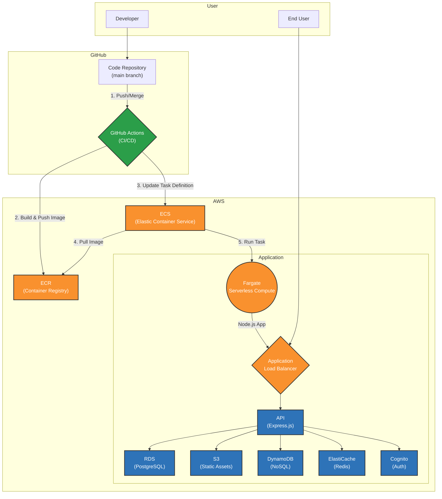

# Nation's Lab LMS - 백엔드 기술 문서

**Version:** 1.0.0
**Last Updated:** 2024-06-27

## 1. 개요 (Overview)

본 문서는 Nation's Lab LMS 백엔드 시스템의 아키텍처, API 명세, 데이터 모델 및 핵심 컴포넌트에 대한 기술적인 내용을 상세히 기술합니다. 이 문서는 프로젝트에 새로 참여하는 개발자가 시스템의 전체 구조를 빠르게 파악하고, 일관된 방식으로 코드를 유지보수 및 확장할 수 있도록 돕는 것을 목표로 합니다.

---

## 2. 시스템 아키텍처 (System Architecture)

본 프로젝트는 GitHub Actions를 통한 CI/CD 파이프라인과 AWS의 관리형 서비스를 기반으로 한 서버리스 아키텍처로 구성되어 있습니다.



-   **CI/CD**: `main` 브랜치에 코드가 병합되면, GitHub Actions가 자동으로 Docker 이미지를 빌드하여 ECR에 푸시하고, ECS 서비스를 업데이트하여 무중단 배포를 수행합니다.
-   **서버리스 컴퓨팅**: AWS Fargate를 사용하여 서버 인프라를 직접 관리할 필요 없이 컨테이너를 실행합니다. 트래픽에 따라 자동 확장이 가능합니다.
-   **데이터 저장소**:
    -   **PostgreSQL (RDS)**: 사용자, 강좌, 성적 등 정형 데이터를 저장합니다.
    -   **DynamoDB**: 동영상 타임마크와 같이 빠른 응답 속도가 필요한 비정형 데이터를 저장합니다.
    -   **S3**: 강의 자료, 과제 제출 파일 등 모든 정적 파일을 저장합니다.
    -   **ElastiCache (Redis)**: 자주 조회되는 데이터를 캐싱하여 API 응답 속도를 개선합니다.

---

## 3. 인증 (Authentication)

본 시스템의 API는 JWT(JSON Web Token)를 사용한 Bearer Token 방식으로 보호됩니다. 인증이 필요한 모든 API는 요청 헤더에 다음과 같이 토큰을 포함해야 합니다.

`Authorization: Bearer <your_jwt_token>`

-   토큰은 AWS Cognito를 통해 발급됩니다.
-   서버는 `jwks-rsa` 라이브러리를 사용하여 Cognito의 JWKS(JSON Web Key Set) URL에서 공개키를 가져와 토큰의 유효성을 검증합니다.
-   `src/middlewares/auth.js`의 `verifyToken` 미들웨어가 이 검증 과정을 처리합니다.
-   특정 API는 `requireRole(['ADMIN', 'INSTRUCTOR'])`와 같은 미들웨어를 통해 역할 기반 접근 제어(RBAC)를 수행합니다.

---

## 4. API 명세 (API Specification)

**서버 URL:**
-   **Production:** `http://lms-alb-599601140.ap-northeast-2.elb.amazonaws.com`
-   **Local:** `http://localhost:3000`

### Tag Groups
-   `Public`: 인증이 필요 없는 공개 API
-   `Auth`: 사용자 인증 및 회원가입
-   `Users`: 사용자 정보 관련 API
-   `Courses`: 강좌 정보 및 수강 관련 API
-   `Enrollments`: 수강 신청 및 상태 변경 API
-   `Assignments`: 학생 과제 제출 관련 API
-   `Timemarks`: 동영상 타임마크 API
-   `Admin / Courses`: 관리자용 강좌 관리 API
-   `Admin / Grades`: 관리자용 성적 관리 API
-   `Admin / Assignments`: 관리자용 과제 관리 API
-   *기타 관리자 API 생략*

---

### **Endpoint: `/api/v1/courses/enrolled/{studentId}`**
-   **Tag:** `Courses`
-   **Method:** `GET`
-   **Description:** 특정 학생이 수강 중인 모든 강좌 목록과 각 강좌의 주차별 학습 자료를 조회합니다.
-   **Security:** `Bearer Token` 필요. 본인이거나 ADMIN 역할이어야 합니다.
-   **Parameters:**
    -   `studentId` (Path, `string`, required): 조회할 학생의 ID.
-   **Responses:**
    -   `200 OK`:
        ```json
        {
            "success": true,
            "data": {
                "courses": [
                    {
                        "id": "course-uuid",
                        "title": "AI 컴퓨터 비전",
                        "instructor_name": "홍길동",
                        "enrollment_status": "ACTIVE",
                        "weeks": [
                            {
                                "weekName": "week1",
                                "weekNumber": 1,
                                "materials": {
                                    "document": [
                                        {
                                            "fileName": "lecture1.pdf",
                                            "downloadUrl": "...",
                                            "size": 1024
                                        }
                                    ],
                                    "video": [
                                        {
                                            "fileName": "video1.m3u8",
                                            "streamingUrl": "...",
                                            "isHlsFile": true
                                        }
                                    ]
                                }
                            }
                        ]
                    }
                ],
                "total": 1
            }
        }
        ```
    -   `403 Forbidden`: 권한이 없는 경우.
    -   `500 Internal Server Error`: 서버 내부 오류 발생 시.

---

### **Endpoint: `/api/v1/admin/assignments/:assignmentId/submissions`**
-   **Tag:** `Admin / Assignments`
-   **Method:** `GET`
-   **Description:** 특정 과제에 대한 모든 학생의 제출 현황 목록을 조회합니다.
-   **Security:** `Bearer Token` 필요. `ADMIN` 또는 `INSTRUCTOR` 역할이어야 합니다.
-   **Parameters:**
    -   `assignmentId` (Path, `integer`, required): 조회할 과제의 ID.
-   **Responses:**
    -   `200 OK`:
        ```json
        {
            "success": true,
            "data": [
                {
                    "studentId": "user-uuid",
                    "studentName": "김철수",
                    "email": "chulsoo@example.com",
                    "submissionId": 123,
                    "submissionStatus": "SUBMITTED",
                    "score": 95,
                    "submittedAt": "2024-05-17T10:00:00.000Z",
                    "isLate": false
                }
            ]
        }
        ```
    -   `403 Forbidden`: 권한이 없는 경우.
    -   `404 Not Found`: 해당 과제가 존재하지 않는 경우.

*(모든 API 엔드포인트에 대한 상세 명세는 /api-docs 경로의 Swagger UI를 참고하십시오.)*

---

## 5. 데이터 모델 (Schemas)

### `Course`
| 필드명 | 타입 | 설명 | 예시 |
| :--- | :--- | :--- | :--- |
| `id` | `string` | 강좌의 고유 ID (UUID) | `"course-uuid-123"` |
| `title` | `string` | 강좌명 | `"Node.js 마스터하기"` |
| `description`| `text` | 강좌 상세 설명 | `"Express와 AWS를 활용한..."` |
| `instructor_id`| `string` | 강사 User ID (Cognito sub) | `"instructor-uuid-456"` |
| `classmode` | `string` | 강의 방식 (`ONLINE`, `VOD`) | `"VOD"` |
| `price` | `integer` | 가격 | `150000` |
| `is_public`| `boolean`| 공개 여부 | `true` |
| `created_at` | `timestamp`| 생성 일시 | |

### `StudentGrade`
| 필드명 | 타입 | 설명 | 예시 |
| :--- | :--- | :--- | :--- |
| `grade_id` | `integer`| 성적 레코드의 고유 ID | `101` |
| `enrollment_id`| `uuid` | 수강 ID (`enrollments.id`) | `"enrollment-uuid-789"` |
| `item_id` | `bigint` | 평가 항목 ID (`grade_items.item_id`)| `201` |
| `score` | `numeric` | 점수 | `95.5` |
| `is_completed`| `boolean`| 완료 여부 | `true` |
| `submission_date`|`timestamp`| 제출 일시 | |
| `submission_data`| `jsonb`| 제출물 데이터 (S3 key 등) | `{"files": ["key.pdf"]}` |
| `feedback` | `text` | 피드백 | `"훌륭합니다."` |

### `Timemark` (DynamoDB)
| 필드명 | 타입 | 설명 | 예시 |
| :--- | :--- | :--- | :--- |
| `id` | `string` | 타임마크 고유 ID (UUID) | `"timemark-uuid-abc"` |
| `timestamp`| `string` | 동영상 시간 (초) | `"123"` |
| `userId` | `string` | 사용자 ID (Cognito sub) | `"user-uuid-def"` |
| `courseId` | `string` | 강좌 ID | `"course-uuid-123"` |
| `videoId` | `string` | 비디오 ID | `"video-id-xyz"` |
| `content` | `string` | 메모 내용 | `"이 부분 중요!"` |
| `createdAt`|`string`| 생성 일시 (ISO 8601) | |

---

## 6. 핵심 코드 컴포넌트

### `src/routes`
-   API의 각 엔드포인트를 정의합니다. Express의 `Router`를 사용하여 모듈화되어 있습니다.
-   각 라우트 핸들러는 요청을 받아 유효성을 검사하고, 필요한 서비스나 유틸리티 함수를 호출한 뒤, 최종 응답을 반환하는 책임을 가집니다.

### `src/middlewares`
-   **`auth.js`**: `verifyToken`과 `requireRole`을 통해 API 요청의 인증 및 권한 부여를 처리하는 핵심 미들웨어입니다.
-   **`error.js`**: 라우트 핸들러에서 발생한 에러를 일관된 형식으로 처리하는 글로벌 에러 핸들러(`errorHandler`)와 404 에러를 처리하는 미들웨어를 포함합니다.
-   **`logger.js`**: `morgan`과 `winston`을 사용하여 모든 수신 요청과 응답 시간을 로깅합니다.

### `src/utils`
-   **`s3.js`**: S3 파일 목록 조회, presigned URL 생성, 권한 관리 등 S3와 관련된 모든 로직을 캡슐화한 모듈입니다.
-   **`dynamodb.js`**: DynamoDB 테이블(예: `LMSVOD_TimeMarks`)에 대한 CRUD 작업을 추상화한 함수들을 제공합니다.
-   **`grade-calculator.js`**: 출석, 과제, 시험 점수와 가중치를 기반으로 학생의 최종 성적을 계산하는 복잡한 비즈니스 로직을 포함합니다.

### `src/config`
-   **`database.js`**: `pg` 라이브러리를 사용하여 PostgreSQL(RDS)에 대한 커넥션 풀을 설정하고 관리합니다.
-   **`s3.js`**, **`dynamodb.js`**: 각 AWS 서비스에 대한 클라이언트 객체를 초기화하고 설정합니다. 프로덕션 환경에서는 IAM 역할을 사용하도록 구성되어 있습니다.
-   **`swagger.js`**: `swagger-jsdoc`을 사용하여 `src/routes` 내의 JSDoc 주석을 파싱하고, Swagger UI에 필요한 API 명세 JSON을 동적으로 생성합니다. 