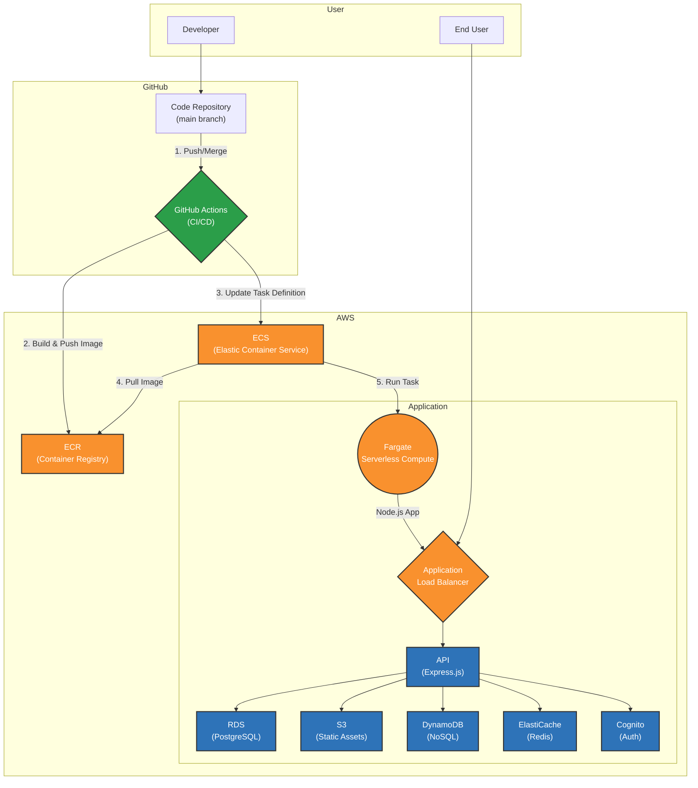

# Nation's Lab LMS - Backend

[](https://github.com/NationLABEducationTeam/lms-back/actions/workflows/deploy.yml)
[](https://expressjs.com/)
[](https://www.postgresql.org/)
[](https://www.docker.com/)
[](https://aws.amazon.com/fargate/)

Nation's Lab LMS 프로젝트의 백엔드 서버입니다. Express.js를 기반으로 구축되었으며, AWS의 강력한 클라우드 서비스를 활용하여 안정적이고 확장 가능한 학습 관리 시스템의 핵심 기능을 제공합니다.

---

## 🏗️ 시스템 아키텍처

본 프로젝트는 GitHub Actions를 통한 CI/CD 파이프라인과 AWS의 관리형 서비스를 기반으로 한 서버리스 아키텍처로 구성되어 있습니다. 개발자가 `main` 브랜치에 코드를 Push하면, 모든 배포 과정은 자동으로 진행됩니다.



---

## 📚 목차

1.  [**기술 스택**](#-기술-스택)
2.  [**코드 레벨 설명**](#-코드-레벨-설명)
    - [프로젝트 구조](#프로젝트-구조)
    - [데이터베이스 스키마](#데이터베이스-스키마)
3.  [**로컬에서 시작하기**](#-로컬에서-시작하기)
    - [사전 준비](#사전-준비)
    - [설치 및 실행](#설치-및-실행)
4.  [**인프라 레벨 설명 (배포)**](#-인프라-레벨-설명-배포)
    - [핵심 원칙: Git Push = Deploy](#핵심-원칙-git-push--deploy)
    - [CI/CD 파이프라인 상세](#cicd-파이프라인-상세)
    - [주요 AWS 서비스 역할](#주요-aws-서비스-역할)
    - [IAM 역할의 이해: `Task Role` vs `Execution Role`](#iam-역할의-이해-task-role-vs-execution-role)
5.  [**API 문서 (Swagger)**](#-api-문서-swagger)
6.  [**환경 변수**](#-환경-변수)

---

## 🛠️ 기술 스택

| 구분             | 기술                               | 설명                                                                   |
| :--------------- | :--------------------------------- | :--------------------------------------------------------------------- |
| **Backend**      | `Express.js`, `Node.js`            | RESTful API 서버 구축                                                  |
| **Database**     | `PostgreSQL (RDS)`, `DynamoDB`     | 정형 데이터(사용자, 강좌)와 비정형 데이터(타임마크) 저장                 |
| **Cache**        | `Redis (ElastiCache)`              | 자주 사용되는 데이터 캐싱을 통한 성능 향상                               |
| **Authentication** | `JWT`, `AWS Cognito`             | 사용자 인증 및 권한 부여                                               |
| **Deployment**   | `Docker`, `AWS ECS`, `AWS Fargate` | 컨테이너 기반의 서버리스 배포 및 운영                                  |
| **Storage**      | `AWS S3`                           | 강의 자료, 과제 제출 파일 등 정적 에셋 저장                            |
| **Logging**      | `Morgan`, `Winston`, `CloudWatch`  | 요청 로깅 및 에러 추적                                                 |
| **API Docs**     | `Swagger`                          | API 명세 자동 생성 및 테스트 UI 제공                                   |

---

## 🖥️ 코드 레벨 설명

### 프로젝트 구조

```
.
├── .github/workflows/  # GitHub Actions CI/CD 워크플로우
├── scripts/            # DB 마이그레이션 등 보조 스크립트
├── src/
│   ├── config/         # 데이터베이스, S3, Swagger 등 외부 서비스 연결 설정
│   ├── db/             # 데이터베이스 마이그레이션 스크립트
│   ├── middlewares/    # 인증(auth), 로깅(logger), 에러 처리(error) 등 미들웨어
│   ├── routes/         # API 엔드포인트 정의 및 라우팅 로직
│   │   └── admin/      # 관리자 전용 API 라우트
│   ├── utils/          # S3 핸들러, 성적 계산기 등 재사용 가능한 유틸리티 함수
│   └── server.js       # 애플리케이션의 메인 진입점 (Express 서버 설정)
├── .dockerignore       # Docker 이미지 빌드 시 제외할 파일 목록
├── .env.example        # 환경 변수 예시 파일
├── Dockerfile          # 애플리케이션의 Docker 이미지 생성 명세
├── package.json        # 프로젝트 의존성 및 스크립트 정의
└── task-definition.json # ECS 작업 정의의 기본 템플릿
```

### 데이터베이스 스키마

데이터베이스는 기능별로 스키마가 분리되어 관리됩니다.

-   **`auth_schema`**: 사용자 정보, 역할 등 인증 관련 데이터
-   **`course_schema`**: 강좌 정보, 목차 등 강좌 관련 데이터
-   **`enrollment_schema`**: 학생의 수강 신청 정보 및 학습 진행률
-   **`grade_schema`**: 과제, 시험, 출결 등 성적 관련 데이터
-   **`review_schema`**: 강의 후기 및 평점 데이터

---

## 🚀 로컬에서 시작하기

### 사전 준비

-   [Node.js](https://nodejs.org/) (v18.x 이상)
-   [NPM](https://www.npmjs.com/) (Node.js 설치 시 자동 설치)
-   [Docker](https://www.docker.com/)

### 설치 및 실행

1.  **레포지토리 복제:**
    ```bash
    git clone https://github.com/NationLABEducationTeam/lms-back.git
    cd lms-back
    ```

2.  **의존성 설치:**
    ```bash
    npm install
    ```

3.  **.env 파일 설정:**
    `.env.example` 파일을 복사하여 `.env` 파일을 생성하고, 로컬 개발 환경에 맞게 변수 값을 수정합니다. ([환경 변수](#-환경-변수) 섹션 참고)

4.  **개발 서버 실행:**
    ```bash
    npm run dev
    ```
    서버는 `http://localhost:3000`에서 실행되며, 파일 변경 시 [nodemon](https://nodemon.io/)에 의해 자동으로 재시작됩니다.

---

## 🚢 인프라 레벨 설명 (배포)

### 핵심 원칙: Git Push = Deploy

이 프로젝트는 GitHub Flow를 기반으로 한 완전 자동화된 CI/CD 파이프라인이 구축되어 있습니다. 개발자는 배포 과정 자체에 개입할 필요 없이, Git 브랜치 전략에 따라 작업하기만 하면 됩니다. **배포를 위해 GitHub Actions 워크플로우를 수정하거나, AWS 자격 증명을 별도로 설정할 필요가 없습니다.**

-   **`main` 브랜치에 Push 또는 Merge**가 발생하면, 변경사항은 자동으로 **프로덕션 서버**에 배포됩니다.

### CI/CD 파이프라인 상세

배포는 `.github/workflows/deploy.yml`에 정의된 GitHub Actions 워크플로우에 의해 진행됩니다.

1.  **`Configure AWS credentials`**: GitHub Secrets에 저장된 AWS 자격 증명을 사용하여, GitHub Actions 러너가 AWS 리소스(ECR, ECS)에 접근할 수 있도록 인증합니다. 이 자격 증명은 **오직 배포 과정에서만** 사용됩니다.
2.  **`Build, tag, and push image to Amazon ECR`**: `Dockerfile`을 기반으로 최신 소스코드가 포함된 Docker 이미지를 빌드하고, AWS ECR(Elastic Container Registry)에 푸시합니다.
3.  **`Fill in the new image ID in the Amazon ECS task definition`**: `task-definition.json` 파일을 템플릿으로 사용하여, ECR에 푸시된 새 이미지의 주소를 포함한 새로운 ECS 작업 정의(Task Definition)를 생성합니다.
4.  **`Deploy Amazon ECS task definition`**: 새로 생성된 작업 정의를 사용하여 ECS 서비스를 업데이트합니다. ECS는 이 새로운 설계도를 보고, 이전 버전의 컨테이너를 새로운 버전의 컨테이너로 교체하는 롤링 업데이트를 진행하여 무중단 배포를 완료합니다.

### 주요 AWS 서비스 역할

-   **ECR (Elastic Container Registry)**: 빌드된 Docker 이미지를 안전하게 저장하는 프라이빗 레지스트리입니다.
-   **ECS (Elastic Container Service) & Fargate**: 컨테이너화된 애플리케이션을 서버리스 환경에서 배포하고 운영합니다. Fargate를 통해 서버 인프라를 직접 관리할 필요 없이 컨테이너 실행에만 집중할 수 있습니다.
-   **RDS (PostgreSQL)**: 메인 데이터베이스를 안정적으로 운영 및 관리합니다.
-   **S3**: 강의 자료, 과제 제출 파일, 이미지 등 모든 정적 파일을 저장하는 확장 가능한 스토리지입니다.
-   **DynamoDB**: 빠른 응답 속도가 필요한 비정형 데이터(예: 타임마크)를 저장하는 NoSQL 데이터베이스입니다.

### IAM 역할의 이해: `Task Role` vs `Execution Role`

ECS는 두 가지 중요한 IAM 역할을 사용하며, 이를 구분하는 것이 매우 중요합니다.

-   **`taskRoleArn` (작업 역할)**: **애플리케이션(컨테이너 내부)이 다른 AWS 서비스에 접근할 때 사용하는 권한**입니다. 예를 들어, Express 서버가 S3에 파일을 업로드하거나 DynamoDB에서 데이터를 읽을 때 이 역할의 권한을 사용합니다. **모든 AWS 서비스 접근 권한은 여기에 부여해야 합니다.**
-   **`executionRoleArn` (실행 역할)**: **ECS 에이전트 자체가 컨테이너를 실행하기 위해 필요한 권한**입니다. ECR에서 Docker 이미지를 PULL 해오거나, CloudWatch에 로그를 전송하는 등의 역할을 수행합니다. 애플리케이션의 로직과는 직접적인 관련이 없습니다.

> **⚠️ 중요**: 프로덕션 환경에서는 보안을 위해 **절대로** AWS Access Key를 환경 변수로 주입해서는 안 됩니다. 모든 권한은 `Task Role`을 통해 관리되어야 합니다.

---

## 🔗 API 문서 (Swagger)

모든 API는 Swagger를 통해 문서화되어 있습니다. 각 엔드포인트의 상세 명세(요청, 응답, 스키마 등)를 확인하고 직접 테스트할 수 있습니다.

-   **운영 서버 API 문서:** `http://<ALB_DNS_NAME>/api-docs`
-   **로컬 서버 API 문서:** `http://localhost:3000/api-docs`

---

## ⚙️ 환경 변수

애플리케이션 실행에 필요한 환경 변수입니다. 로컬 개발 시 `.env` 파일에 설정해주세요.

```dotenv
# Server Configuration
PORT=3000

# AWS Credentials (로컬 개발 시에만 필요)
# 프로덕션(ECS)에서는 IAM 역할을 사용하므로 절대 설정하지 않습니다.
AWS_REGION=ap-northeast-2
AWS_ACCESS_KEY_ID=...
AWS_SECRET_ACCESS_KEY=...
# VITE_ 접두사는 프론트엔드 빌드 시 변수를 주입하기 위함입니다.
VITE_AWS_REGION=${AWS_REGION}
VITE_AWS_ACCESS_KEY_ID=${AWS_ACCESS_KEY_ID}
VITE_AWS_SECRET_ACCESS_KEY=${AWS_SECRET_ACCESS_KEY}

# Database (PostgreSQL - Amazon RDS)
DB_HOST=...
DB_PORT=5432
DB_USER=...
DB_PASSWORD=...
DB_NAME=lms_db

# AWS Cognito for JWT Authentication
COGNITO_JWKS_URL=...

# Redis (Amazon ElastiCache)
ELASTICACHE_HOST=...
ELASTICACHE_PORT=6379
```
